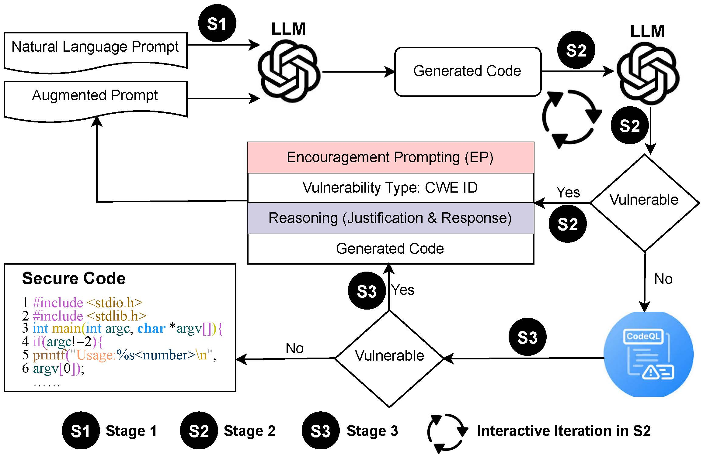
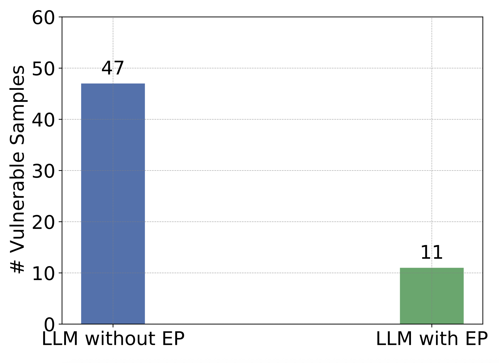
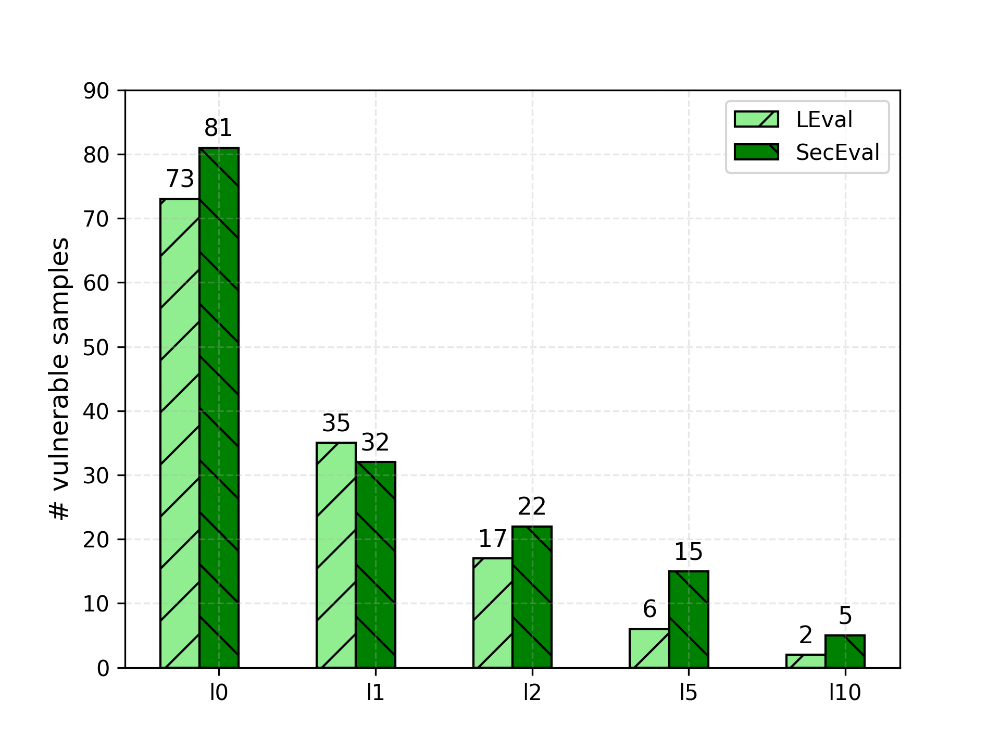
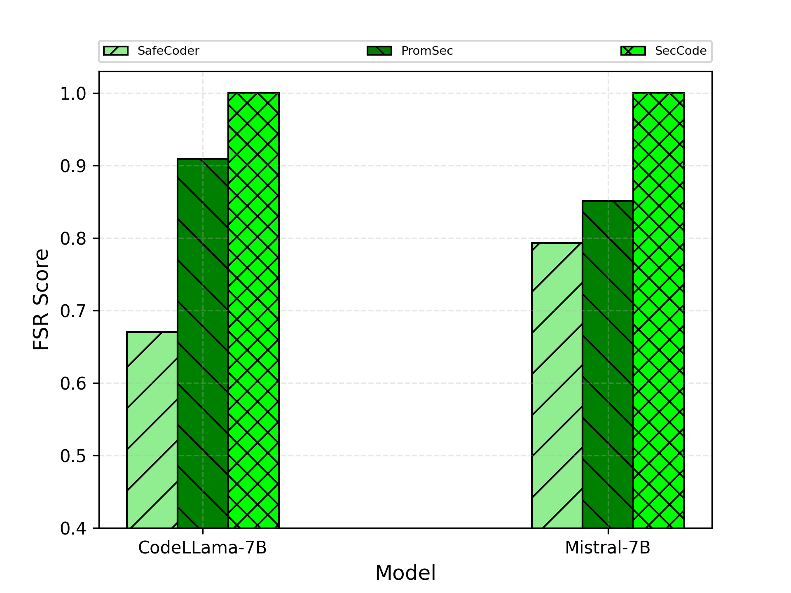

# SeCode
From Commands to Interactive Encouragement: Securing Code Generation via LLM Prompts

## Abstract

Large Language Models (LLMs) have shown remarkable potential in code generation, making them increasingly important in the field. However, the security issues of generated code have not been fully addressed, and the usability of LLMs in code generation still requires further exploration.

This work introduces **SecCode**, a framework that leverages an innovative **Encouragement Prompting (EP)** technique for secure code generation from only natural language (NL) prompts. This approach ensures that the prompts can be easily shared and understood by general users.

SecCode functions through three stages:

1. **Code Generation using NL Prompts**  
2. **Code Vulnerability Detection and Fixing**, utilising our proposed EP  
3. **Vulnerability Cross-Checking and Code Security Refinement**  

These stages are executed in multiple interactive iterations to progressively enhance security.

To demonstrate the effectiveness of SecCode, we evaluated it across multiple scenarios, including comparisons with various baselines (such as prompt-based LLMs) and assessments using different LLMs on diverse datasets for secure code generation.

**Extensive experimental results show that SecCode greatly outperforms baseline methods**, achieving a fix success rate of **92% for generated C++** code and **100% for Python** code.

- To the best of our knowledge, this work is among the first to formulate secure code generation with NL prompts only. 

This respository is an open-sourced code of Secode to encourage the community to contribute toward advancing secure code generation.

---

## Proposed Methodology

The SecCode framework operates in an interactive loop with the following core components:

- **Encouragement Prompting (EP)**: A novel prompting mechanism that improves the security context of generated code.
- **Natural Language to Code Generation**: Utilizes powerful LLMs to generate code from user-provided natural language descriptions.
- **Vulnerability Detection and Auto-Fix**: Analyzes code for security flaws using static and AI-based analysis tools, applying EP-driven fixes.
- **Iterative Refinement**: The generation–fix–review loop continues until secure, clean code is produced.

---

## Architecture Overview

---
## Results

<h3 align="center">Comparison of Results</h3>

<table>
  <tr>
    <th>Experimental results for the LLM with/without EP after 5 interactive iterations based on LEval Dataset</th>
    <th>Experimental results for the number of vulnerabilities identified as a relationship with the number of conducted interactive iterations on LEval and SecEval datasets. I0: means the original generated code; I1: the first iteration; etc.</th>
    <th>Comparison of the proposed SecCode with the baselines of CodeSafer and PropSec for the two LLMs (left: CodeLlama-7B, right: Mistral-7B). SecCode yields outstanding performance.</th>
  </tr>
  <tr>
    <td></td>
    <td></td>
    <td></td>
  </tr>
</table>

